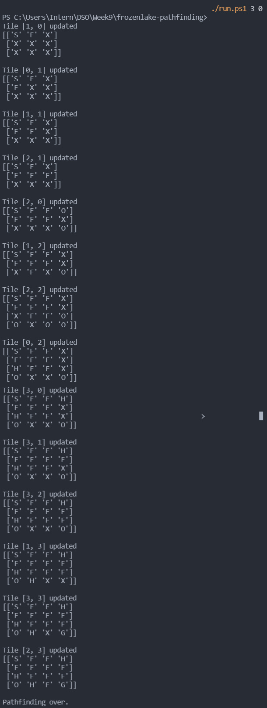

# FrozenLake Pathfinding

* Created this tool to teach myself on how to use Prolog for work use.
* Created also to teach myself how to implement a basic path-finding algorithm.

### Demonstration
* Process of pathfinding through the target.

* Results file.


### Description
* Pathfinding from Start to Goal of the FrozenLake OpenAI Gym environment, using Python and Prolog scripts. 
* Paths are tested to check if they would succeed or fail in reaching the goal.
* FrozenLake maps are randomized, though the length can be specified (default 4).

### Usage
1. Run ```git clone https://github.com/syueyang-dso/frozenlake-pathfinding.git``` in directory you want to install the repository.
2. Run ```cd frozenlake-pathfinding```.
3. Run ```./run.ps1 <length> <expand>``` (Windows) or ```./run.sh <length> <expand>``` (Linux). 
    * ```\<length\>``` is length of FrozenLake randomized map, and ```\<expand\>``` is a 0-1 value of a random chance of the map being larger than the specified length. 
    * ```./run.ps1``` and ```./run.sh``` use ```\<length\>``` 4 and ```\<expand\>``` 0.
    * If ```./run.sh <length> <expand>``` gives permission denied error, run ```chmod 777 ./run.sh``` and then try again.
